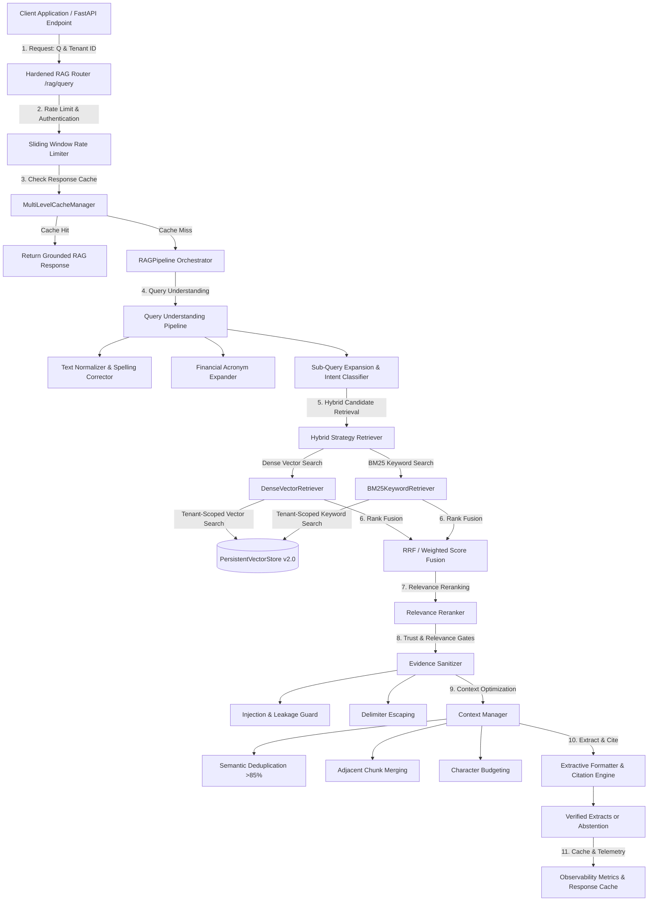

# WealthGenie Trust-Gated Retrieval Architecture

The current containment release is a multi-tenant, observable, trust-gated **extractive retrieval** engine. It returns verified excerpts and citation IDs or explicitly abstains. LLM-grounded synthesis is deliberately deferred until factual-support governance is implemented.

---

## 🏛️ 1. Architecture Overview



---

## 📦 2. Subsystem Components

| Module | Location | Description |
|:---|:---|:---|
| **Evaluation Framework** | `rag/evaluation/` | Retrieval hit/recall, citation-ID validity, lexical support, and abstention correctness. Citation-ID validity is not factual entailment. |
| **Reranking Pipeline** | `rag/reranking/` | Abstract `BaseReranker` with `NoOpReranker` and `RelevanceScoreReranker` for boosting exact keyword matches. |
| **Hybrid Retrieval** | `rag/retrievers/` | Combines `DenseRetriever` and `BM25KeywordRetriever` with Reciprocal Rank Fusion (RRF) and Weighted Score Fusion. |
| **Query Understanding** | `rag/query_understanding/` | Text normalization, spelling correction, financial acronym expansion, intent classification, and query rewriting. |
| **Prompt Security** | `rag/security/` | Sanitizes inputs against prompt injections, system prompt role leaks, and delimiter escaping. |
| **Context Management** | `rag/context/` | Semantic chunk deduplication (>85% similarity), adjacent chunk merging, and token/character budgeting. |
| **Observability** | `rag/observability/` | Records per-stage execution latency, token counts, cache statistics, and exports JSON telemetry snapshots. |
| **Caching Engine** | `rag/cache/` | Multi-tier TTL caching (response cache, retrieval cache, embedding cache) with tenant isolation. |
| **Vector Store Hardening**| `rag/vector_store/` | Local development uses the persistent file store; shared deployments use Mongo-backed chunks and a corpus revision check. Mongo indexes are migration-owned and verified read-only by the service. |
| **Document Lifecycle** | `rag/lifecycle/` | Manages document versioning, soft deletion, hard deletion with vector chunk purging, and metadata updates. |
| **Multi-Tenant Readiness** | `rag/schema.py`, `vector_store/`, `retrievers/` | Enforces strict `tenant_id` scope isolation across storage, retrieval, caching, and pipelines. |
| **API Hardening** | `rag/router.py`, `main.py` | Sliding window rate limiting (60 req/min), HTTP security headers (`nosniff`, `DENY`), Pydantic validation, and standard error handling. |
| **Configuration** | `rag/config.py` | Centralized `RAGConfig` supporting `.env` variables (`RAG_*`), JSON configuration files, and model validations. |
| **Benchmarking** | `rag/benchmark.py` | Measures ingestion throughput (docs/sec, chunks/sec) and query execution latency percentiles (P50, P90, P99). |
| **Structured Logging** | `rag/logging.py` | Emits structured JSON logs to stdout and persistent `reports/rag_store/rag_execution.log`. |

---

## 🔌 3. REST API Specification

### `POST /rag/query`
Executes trust-gated extractive search over authoritative knowledge-base chunks.
- **Request Payload**:
  ```json
  {
    "question": "What does the currently effective tax source say about this rule?",
    "top_k": 4,
    "tenant_id": "default"
  }
  ```
- **Response Payload**:
  ```json
  {
    "answer": "Extracts from verified financial or regulatory sources...",
    "citations": [
      { "citation_id": 1, "document_title": "Manifest-verified source", "relevance_score": 1.0 }
    ],
    "retrieved_chunks": [...],
    "metrics": { "response_mode": "extractive_retrieval", "chunks_retrieved": 2 },
    "grounded": true
  }
  ```

### `POST /rag/index`
Direct user text is rejected as authoritative advisory evidence. Verified corpus ingestion occurs through the internal ingestion pipeline; explicit administrative overrides are quarantined and cannot influence advisory retrieval.
- **Request Payload**:
  ```json
  {
    "title": "Manifest-verified source title",
    "content": "Direct user text is not accepted as verified regulatory evidence...",
    "source": "tax_code.pdf",
    "tenant_id": "default"
  }
  ```

### `GET /rag/documents`
Lists all registered documents in the knowledge base.

### `DELETE /rag/documents/{doc_id}`
Deletes or soft-deletes a document and purges all associated vector index chunks.

---

## ⚙️ 4. Environment Configuration

All hyperparameters can be overridden via environment variables prefixed with `RAG_`:

| Environment Variable | Default | Description |
|:---|:---|:---|
| `RAG_CHUNK_SIZE` | `512` | Text chunk size in characters |
| `RAG_CHUNK_OVERLAP` | `64` | Overlap size between consecutive chunks |
| `RAG_TOP_K` | `4` | Number of top chunks to retrieve |
| `RAG_SIMILARITY_THRESHOLD` | `0.1` | Minimum cosine similarity threshold |
| `RAG_RETRIEVAL_STRATEGY` | `hybrid` | Retrieval strategy (`dense`, `keyword`, `hybrid`) |
| `RAG_FUSION_MODE` | `rrf` | Rank fusion mode (`rrf` or `weighted`) |
| `RAG_RERANKER_STRATEGY` | `no_op` | Reranker strategy (`no_op`, `relevance_score`) |
| `RAG_VECTOR_STORE_PATH` | `reports/rag_store/vector_index.json` | Index storage file path |

---

## 🧪 5. Testing & Verification

### Shared-state database migration

When `ML_STATE_BACKEND=mongodb` is selected, run the explicit Phase-3 migration
once, after MongoDB is ready and before starting ML service replicas:

```bash
cd ml-service
MONGODB_URI="$MONGODB_URI" python scripts/migrate_phase3_state.py
```

The migration installs model-registry, immutable GridFS bundle, RAG document-
revision, corpus-generation, and vector-chunk indexes, and records schema
version `phase3_shared_state/3`. Application startup verifies the marker and
index definitions read-only; it does not create or repair indexes.

For Mongo-backed deployments, run the explicit serving-bundle bootstrap after
the migration and before starting ML replicas:

```bash
cd ml-service
WEALTHGENIE_PHASE3_BOOTSTRAP=1 \
ML_STATE_BACKEND=mongodb \
ENVIRONMENT=production \
MONGODB_URI="$MONGODB_URI" \
python scripts/register_trusted_bundles.py
```

The bootstrap verifies external trust anchors, stores complete bundles in
shared GridFS, and establishes a trusted baseline only when an architecture
has no active version. Repeated runs do not replace an existing active model.
Deployments run this as a controlled one-shot job after both schema migrations
and before application replicas.

The shared RAG corpus has a separate explicit bootstrap. The image carries the
pinned Sentence Transformer revision; production startup is offline-only and
does not seed or repair corpus state:

```bash
cd ml-service
WEALTHGENIE_RAG_BOOTSTRAP=1 \
ML_STATE_BACKEND=mongodb \
ENVIRONMENT=production \
MONGODB_URI="$MONGODB_URI" \
python scripts/bootstrap_rag_corpus.py
```

This operation establishes/validates the embedding-space identity, seeds only
hash-verified current manifest documents, and verifies readiness before API
replicas start. A corpus generation is an immutable record containing the
manifest hash, normalized embedding identity, active revision membership and
membership digest. A singleton `rag_corpus_state` pointer is updated with a
monotonic revision in the same Mongo transaction as ingestion, deletion, or
metadata revision. Membership records are append-only; chunks are searchable
only when they belong to the exact active generation membership. Startup
verification is read-only, and `/rag/readyz` fails when the active generation,
manifest, lifecycle state, or loaded vector index do not reconcile.

Mongo document lifecycle state is shared in `rag_document_revisions`,
`rag_corpus_generations`, `rag_corpus_generation_members`, and
`rag_corpus_state`. Ingestion writes a complete pending revision, its chunks,
the immutable generation membership, and the current pointer in a Mongo
transaction. Retrieval refreshes against the shared generation identity and
includes only chunks bound to active document revisions and compatible
embedding identity. Local development continues to use the file-backed
lifecycle and vector store. Mongo-backed production does not use
`documents.json` as lifecycle authority.

Run the full platform test suite:
```bash
python -m pytest tests/ -p no:phoenix -v
```

Execute performance benchmarking:
```python
from rag.benchmark import RAGBenchmarkSuite
suite = RAGBenchmarkSuite()
print(suite.run_ingestion_benchmark(num_docs=10))
print(suite.run_query_benchmark(num_queries=20))
```
